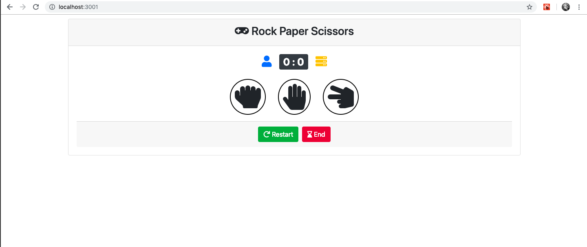

Please run 'npm install' to install required npm dependencies

Run 'npm test' to test component rendering, test can be found in App.test.js

Run 'npm start' to run application

screen-shots folder contains screenshots of application behaviour

bootstrap used for responsiveness, font-awesome used for icons

Result will display only for end button click or automatic game end. For restart button click result won't get displayed

local-storage used to store data so after refresh player can continue with previous game
